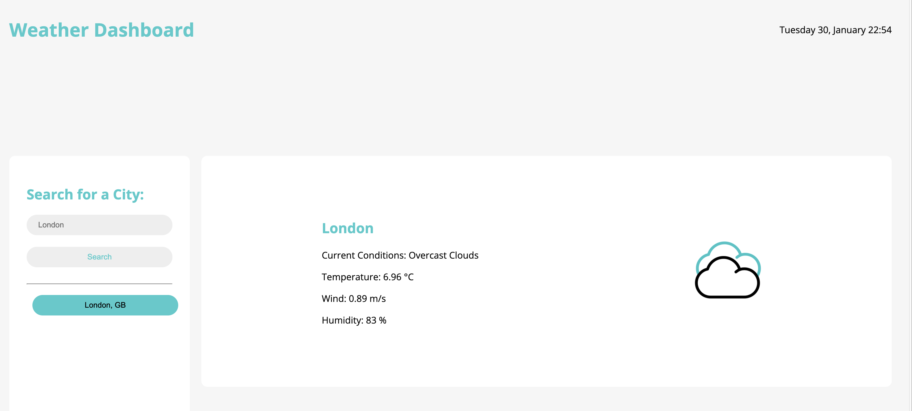

# weather-dashboard
A web app that outputs the weather forecast of a chosen city.

The link to the deployed Github page can be found [here](https://github.com/nolythedev/weather-dashboard/).

## Table of Contents (Optional)

* [Installation](#installation)
* [Usage](#usage)
* [Credits](#credits)
* [License](#license)

## Installation

* Clone the repository: git clone https://github.com/nolythedev/weather-dashboard.git
* Navigate to the project directory: cd weather-dashboard
* Open the codebase in your preferred code editor.

## Usage 

N/A

## Credits

Thank you to the edX, freecodecamp and MDN Web Docs.

## License

MIT License. 

---

© 2024 edX Boot Camps LLC. Confidential and Proprietary. All Rights Reserved.
